# OSCAR Team Robothon documentation

## Equipment used list

### Overall setup

The following image gives an overview of the robotic setup. The main visible components are:

- Franka Emika robot + gripper
- Photoneo M 3D scanner
- HTC Vive motion-capture setup (lighthouses + remote control)

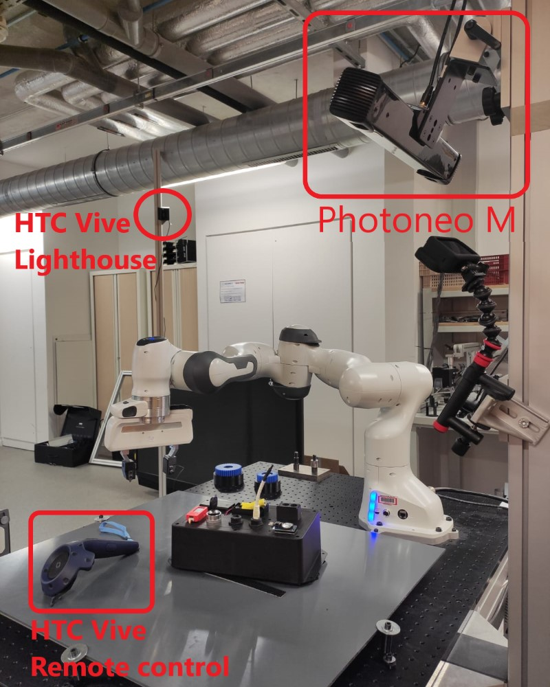

### Robot

The current setup uses a 7 DOF Franka Emika collaborative robot.
Robot control is done using the low level _Franka Control Interface_, connected to our in-house CEA LIST CORTEX robot controller. 

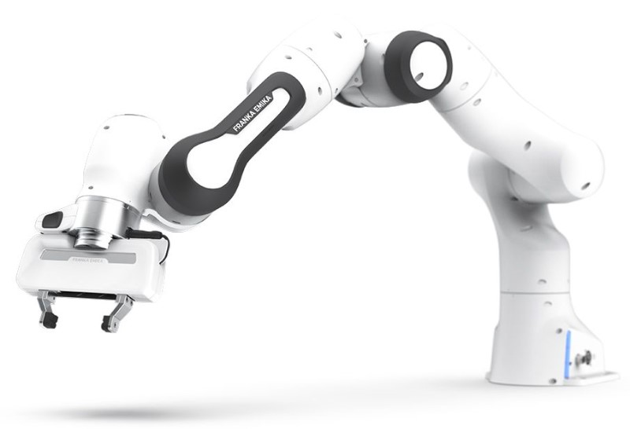

### Gripper

We use the standard Franka Emika gripper, with custom 3D printed fingertips. 
Those fingertips provide 3 surfaces of interest for improved dexterity, as illustrated in the next figure:
- clamping surface: the main gripping area, approx. 30x30mm, covered with rubber for improved gripping capability. Used for general grasping tasks.
- pressing surface: the tip of each jaw is covered with rubber (approx. 10x30mm) to enable shear forces application. Used for battery lid removal.
- steel blade: each jaw is equipped with a small (non cutting) steel blade, to provide fine poking and clawing capability. Used for batteries removal.

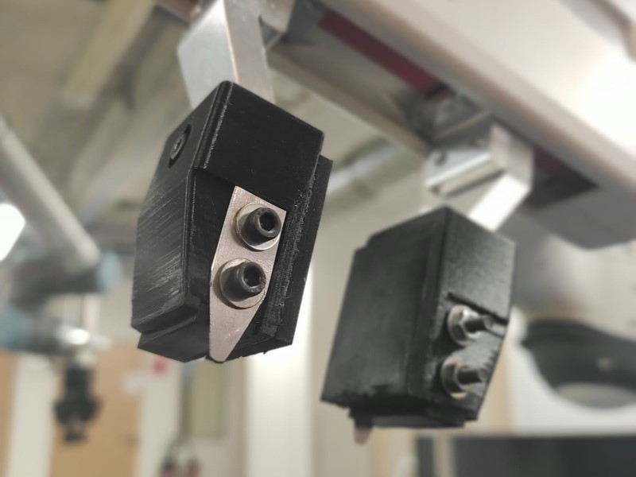

### Teaching

Our team is using a _HTC Vive_ Motion-capture setup to teach easily various geometric primitives, such as waypoints and motions. 
Teaching is done with the HTC remote control. The current setup includes four LightHouses, to limit visual occlusions. The VR helmet is not used in this setup. 

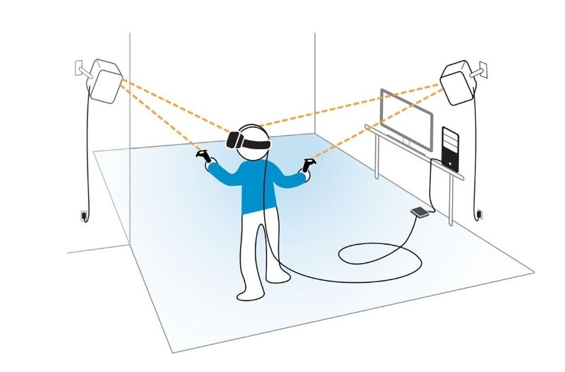

The HTC remote control is equipped with a custom 3D printed extension that provides a pointing tip to the user. All geometric primitives are learned in the tip frame. 

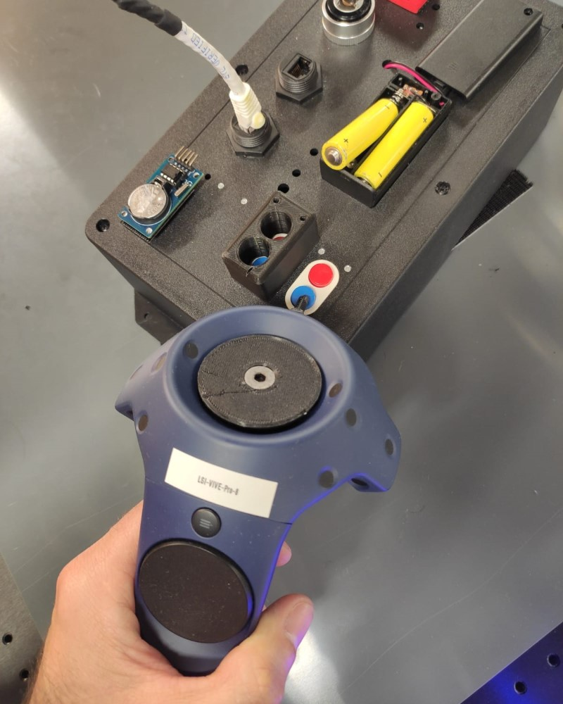
### Localization

Localization of the board is done with a _Photoneo PhoXi M_ 3D scanner (https://www.photoneo.com/products/phoxi-scan-m/).
The Photoneo is placed on a fixed pole, calibration with relation to the robot is done once. 

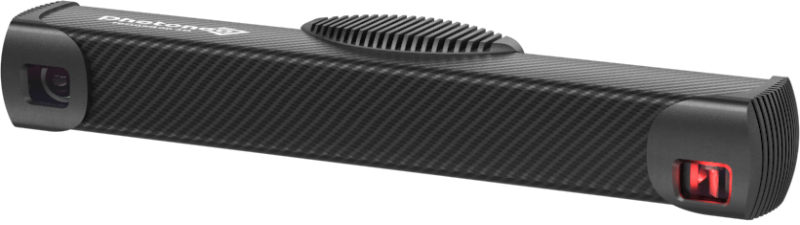

The photoneo provides a 3D pointcloud of the scanned area, which can be used to compute pose transformations of the taskboard, between a reference position and the current position. Next image provides an illustration of a typical photoneo scan.

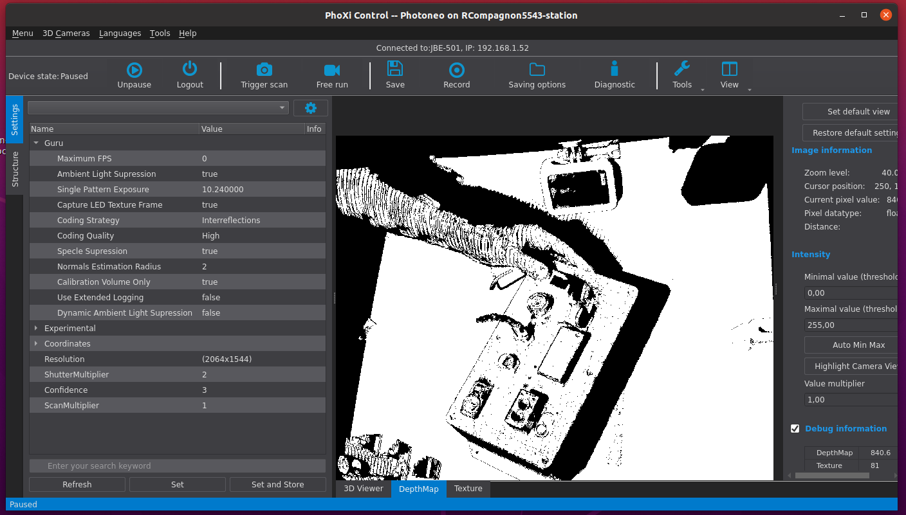

## Software dependency list

The main software modules needed to operate the system are:
- CEA LIST CORTEX robotic framework : CORTEX is a component-oriented real-time C++ framework dedicated to robot controllers 
  development. It allows full control on the robot control logic. In the case of the Franka Emika robot, CORTEX is used to implement dedicated hybrid force/position motion control strategies, and provide a standard robotic API to our skills framework.
- CEA LIST SPIRE skills framework : this framework implements our version of the skill concept, and provides multiple toolboxes for teaching by demonstration, geometric data processing, skills composition and execution. 
- CEA LIST Phosphorus framework : Phosphorus is a tool combining a user GUI and an execution engine, dedicated to graphical design of vision-based algorithms. It’s based on dataflow diagrams, and provides a rich library of algorithms from well-known third party libraries such as open-cv and so on. 
- ROS : used as a communication middleware between SPIRE and Phosphorus frameworks

The following diagram illustrates the relationship between these modules.
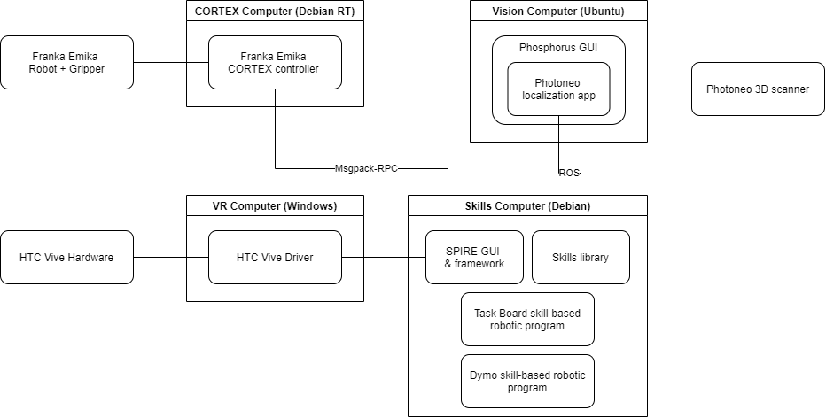

The Phosphorus diagram for the Photoneo object localization feature:
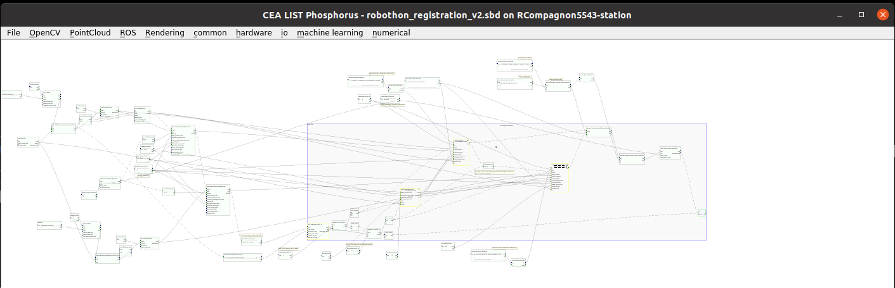

Those modules use various third party C++ and Python libraries, all of them being open-source projects, such as :
- Eigen : for C++ matrix computations
- Numpy : for python mathematical computations
- Open-CV : for 2D/3D image computation
- Msgpack-RPC : for RPC communication between SPIRE & CORTEX

## Quick start guide
[TODO]
The typical execution workflow follows these steps. All supervision is done from the "skills" computer. 
### Step 1 - Launch of software applications

1. Launch of the CORTEX robot controller via a ssh remote connection to the Debian-RT computer.
2. Launch of the SPIRE GUI
3. Launch of the Photoneo management on the dedicated computer
   1. Launch of ROSCore
   2. Launch of PhoXi (Photoneo application)
   3. Launch of the Phosphorus diagram dedicated to the Photoneo localization
   4. Launch of the ROS server

Next image illustrates the launch commands for the CORTEX controller and the SPIRE GUI.
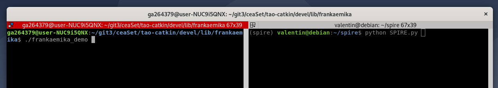

### Step 2 - Load & configure skills project

1. Loading of the geometric primitives data file related to the taskboard application
2. Loading of the skills project (sequence for the taskboard)
3. If needed, geometric primitives adjustment

SPIRE GUI - Geometric primitives management tab:
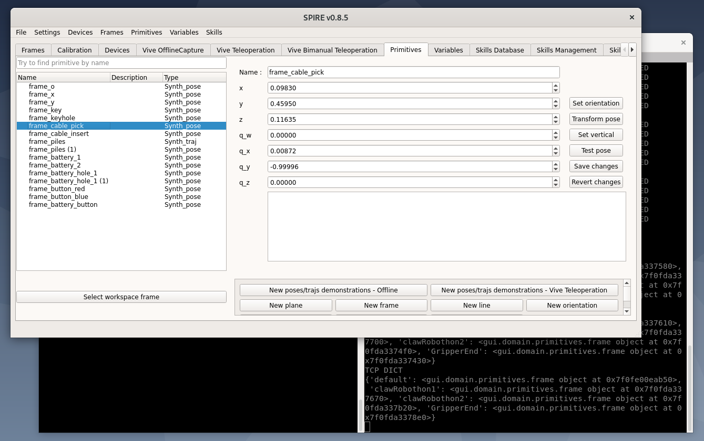

### Step 3 - Run skill program

1. If needed, change the primitives mapping to the skills
1. Just run the top skill (since our skill concept is recursive, the whole sequence is a meta-skill)

SPIRE GUI - Skills management tab:
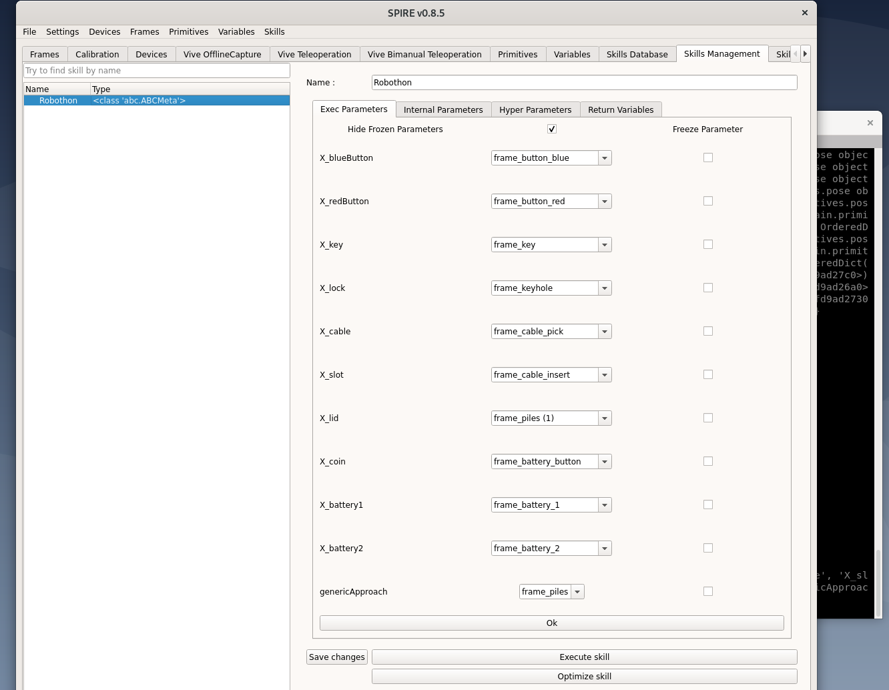

